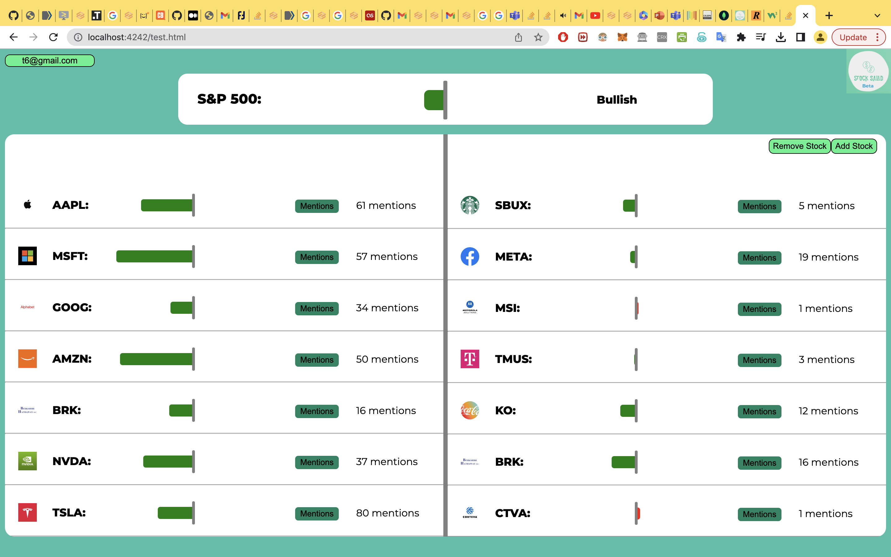
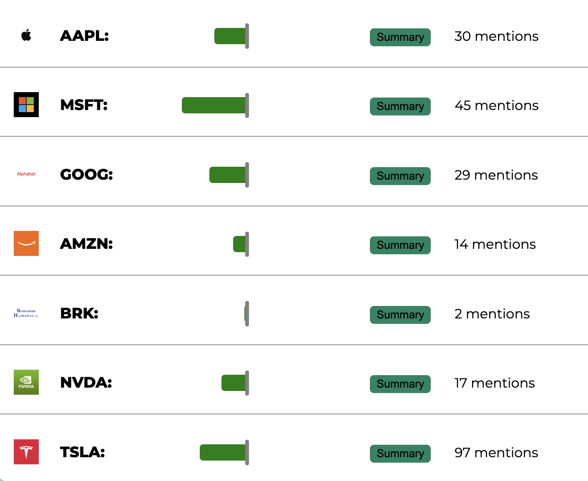

A prototype SaaS that scrapes stock news and gives users stocks' overall news sentiments based on news articles, as well as gives users news summaries for all stocks. 
Main dashboard consists of 4 sections in a grid, these are:
1. News sentiments and summaries of highest valued stocks
2. News sentiments and summaries of custom stocks picked by user
3. News sentiments and summaries of top stocks by sentiment
4. News sentiments and summaries of lowest stocks by sentiment

This is just a prototype. Security vulnerabilities, backend infrastructure and other more technical aspects aren't taken into account.

This project uses the following libraries, frameworks and APIs:
1. Stripe NodeJS API
2. Firebase SDK
3. Alphavantage financial data API
4. Polygon financial data API
